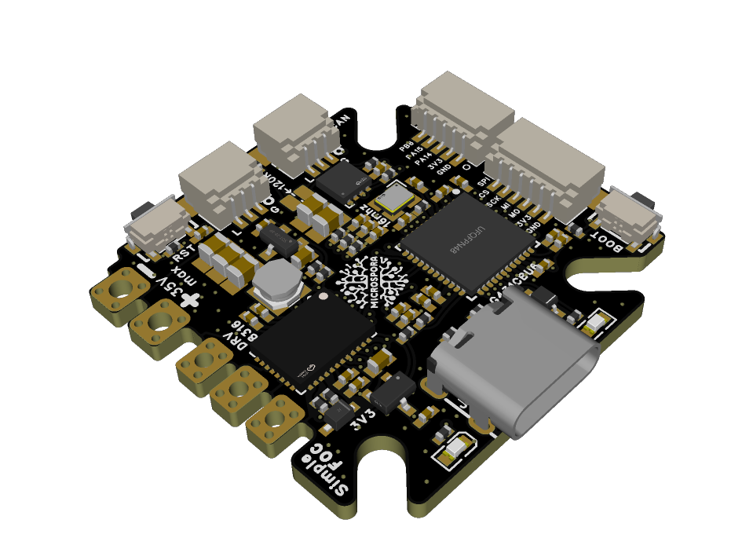
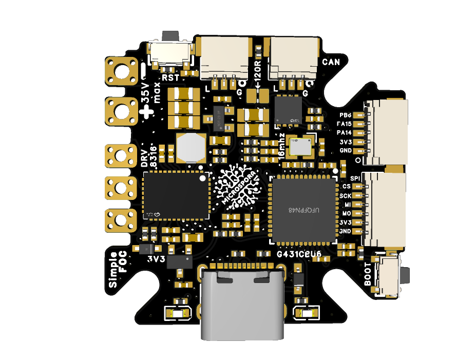
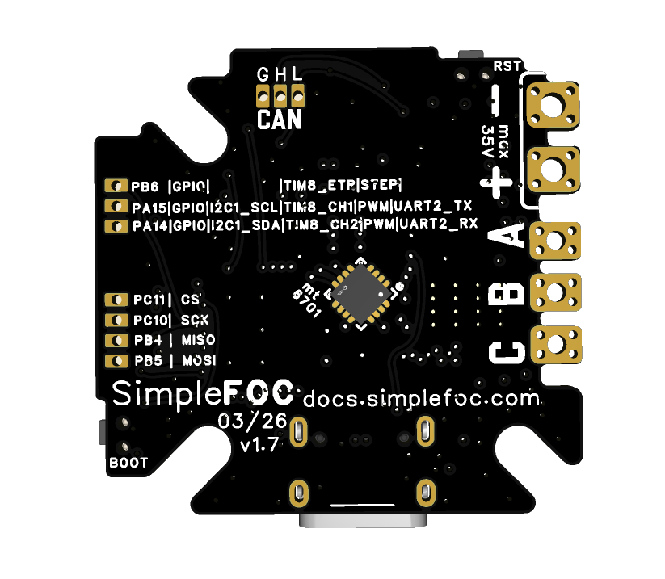
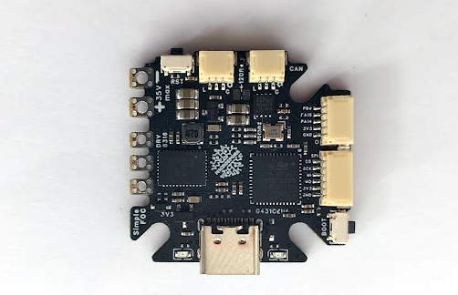
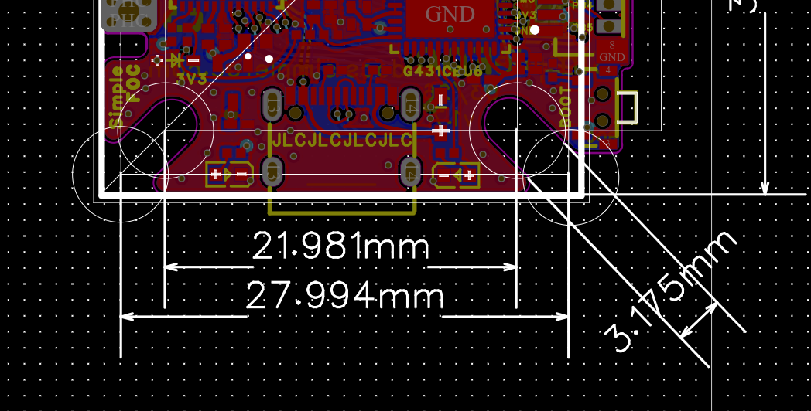
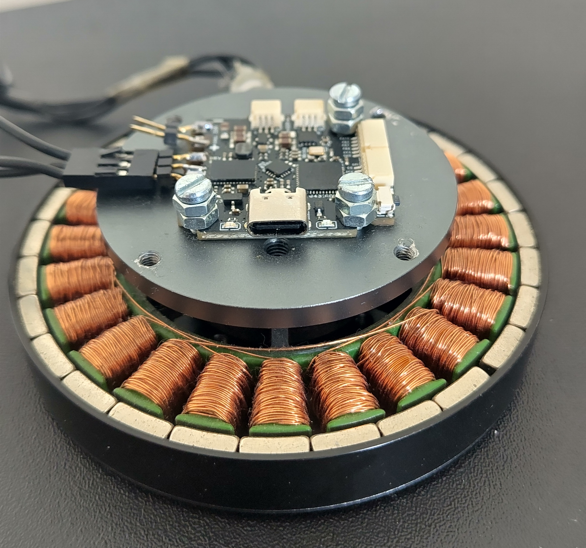
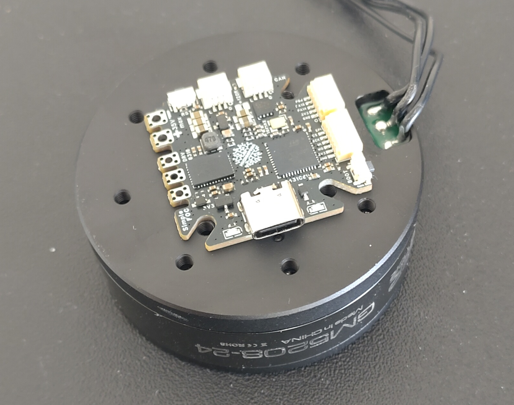
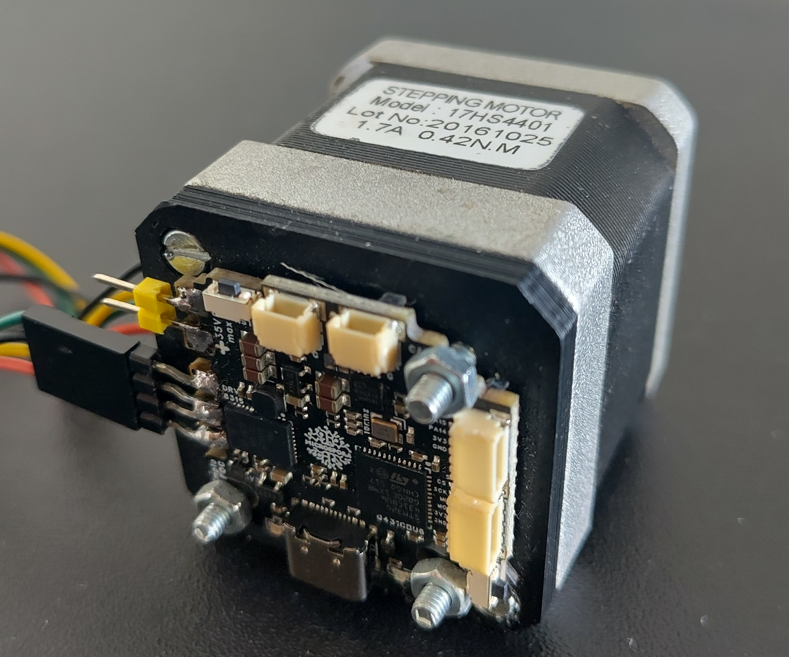

# SimpleFOC-microspora v1.7
This is a compact all-in-one BLDC/Stepper driver board built for the SimpleFOC ecosystem. The project is a direct fork of the [MicroSpora board from RamBros](https://github.com/rambros3d/MicroSpora-SimpleFOC).

## Features
- MCU: STM32G431CBU6
- Driver: DRV8316
- Sensing
  - MT6701 magnetic encoder support
  - Built for current and voltage sensing
- Connectivity
  - CAN JST connector with daisy-chain support
  - SPI JST connector
  - I2C / Encoder / GPIO 5-pin JST connector
  - Stemma / Qwiic-style compatible interface
- Compact form factor: 33mm x 34mm
- Fully compatible with the SimpleFOC library
- Designed to be a nice entry point with SimpleFOC 
    - for low-power BLDC motors
    - for stepper motors
- Open-source: [EasyEDA link](https://oshwlab.com/the.skuric/microspora-simplefoc-antun)
- Low-cost: 
    - designed to be affordable for hobbyists and makers
    - At JLCPCB, the board can be manufactured for about 20$ 
    - *Will be available for purchase soon through our partner **MakerFabs***

## Getting started with SimpleFOC-microspora

The example firmware and reference code can be found in the [microspora_simplefoc_firmware repository](https://github.com/pollen-robotics/microspora_simplefoc_firmware).

- The firmware repository shows how to get started with the board and use it with the SimpleFOC library.
- For more community discussion and help, you can follow the SimpleFOC community forum and Discord.

## Release log

Release | Date | Description
--- | --- | ---
v0.1 | 2025-05 | Initial public release of the MicroSpora board by [@RamBros](https://github.com/rambros3d/MicroSpora-SimpleFOC)
v1.2 | 2025-07 | Added CAN and additional GPIOs JST connectors, gone from 6-layer to 4-layer PCB
v1.4 | 2025-12 | Added CAN daisy-chain support + two additional JST connectors for SPI and I2C/Encoder/GPIO
v1.5 | 2026-01 | Pinout refining
v1.6 | 2026-04 | Optimising the JST pinout, compatibility with Stemma / Qwiic-style connectors, reintroduced the Reset button
v1.7 | 2026-06 | Changed the sensor placement to the bottom side, much better performance for stepper motors

## Fastening holes

The board has 3 slots allowing for M3/M2 screws to be used for fastening the board to a surface or enclosure. The slots are 3.2mm wide and 5mm long, allowing for some flexibility in placement.

The placement will allow for most of the gimbal motors as GM2808, GM3506, GM4108, GM5208 etc. And a simple 3d-printed part cna be used in cases where the motor holes do not match the board holes. 

## Connectors 

The board has a double 3-pin JST connector for daisy-chaining multiple boards using CAN. The order of pins is 

Number | Pin 
--- | --
1| GND
2 | CAN_H 
3 | CAN_L

The board has an additional 6-pin JST connector for SPI, with the following pinout:

Number | Pin|    Function 
--- | -- | ---
1| GND | GND
2|3.3V | 3.3V
3| PB5 | MISO
4| PB4 | MOSI 
5| PC10|  SCK 
6| PC11 | CS 

> Note: This SPI bus is the same one used for the DRV8316 driver, so make sure to configure the driver before you use the SPI bus for other purposes.

Finally, the board has a 5-pin JST connector for I2C, encoder, and GPIO. The pinout is as follows:
Number | Pin| GPIO  | I2C | Timer/Encoder | Step/Dir | PWM input | UART
--- | -- | ---  | ---| ---| ---| ---| ---
1| GND | GND | - | - | -| -| -| -
2| 3.3V | 3.3V | - | - | -| -| -| -
3| PA14 | GPIO | I2C1_SDA | TIM8_CH2 | Dir in| PWM in| USART2_RX
4| PA15 | GPIO | I2C1_SCL | TIM8_CH1 | Dir in| PWM in| USART2_TX
5| PB6 |  GPIO  | -       | TIM8_ETR | Step | -| -

So this connector can be used for I2C, encoder, or GPIO depending on your application. Qwiic / Stemma-style cables can be used to connect to this connector, even though it is 5-pin instead of the usual 4-pin. For most cases teh 4-pin stemma cable will work fine.

## Pinout summary

The board exposes the main motor, sensing, communication, and power-monitoring signals in a compact pin map suitable for SimpleFOC firmware configuration.

### Motor driver and sensing

| Signal | Pin | Description |
| --- | --- | --- |
| PHA_H | PA10 | High-side PWM for phase A |
| PHA_L | PB15 | Low-side PWM for phase A |
| PHB_H | PA9 | High-side PWM for phase B |
| PHB_L | PB14 | Low-side PWM for phase B |
| PHC_H | PA8 | High-side PWM for phase C |
| PHC_L | PB13 | Low-side PWM for phase C |
| ISENS_A | PA0 | Phase A current sense |
| ISENS_B | PA1 | Phase B current sense |
| ISENS_C | PA2 | Phase C current sense |
| VSENS | PB11 | Supply voltage sense input   Voltage divider scaling factor is 11.0 (4.7k / 47k) |

### Driver SPI interface

| Signal | Pin | Description |
| --- | --- | --- |
| DRV_MOSI | PB5_ALT1 | DRV8316 SPI MOSI |
| DRV_MISO | PB4_ALT1 | DRV8316 SPI MISO |
| DRV_SCK | PC10 | DRV8316 SPI clock |
| DRV_CS | PC4 | DRV8316 SPI chip select |

### MT6701 magnetic encoder

| Signal | Pin | Description |
| --- | --- | --- |
| ENC_SDO | PA6 | Encoder SPI MISO |
| ENC_NC | PA7 | Not connected (dummy MOSI) |
| ENC_CLK | PA5 | Encoder clock |
| ENC_CS | PA4 | Encoder chip select |

### CAN transceiver

| Signal | Pin | Description |
| --- | --- | --- |
| CAN_RX | PB8 | CAN receive |
| CAN_TX | PB9 | CAN transmit |
| CAN_ENABLE | PC13 | CAN transceiver enable |

The board also has a reset and boot button, as well as a user LED connected to PC6.

## Notes

The full documentation is still being expanded, but the project is already designed for use with the SimpleFOC ecosystem and supports the core features needed for compact low-power BLDC control.

For now, you can follow the discussions on the [SimpleFOC community forum](https://community.simplefoc.com) or the project Discord server for updates and usage tips.

